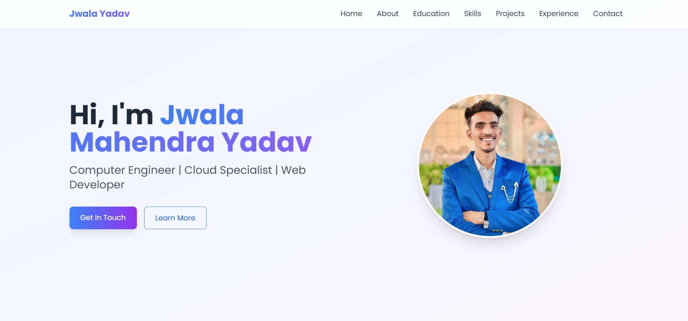
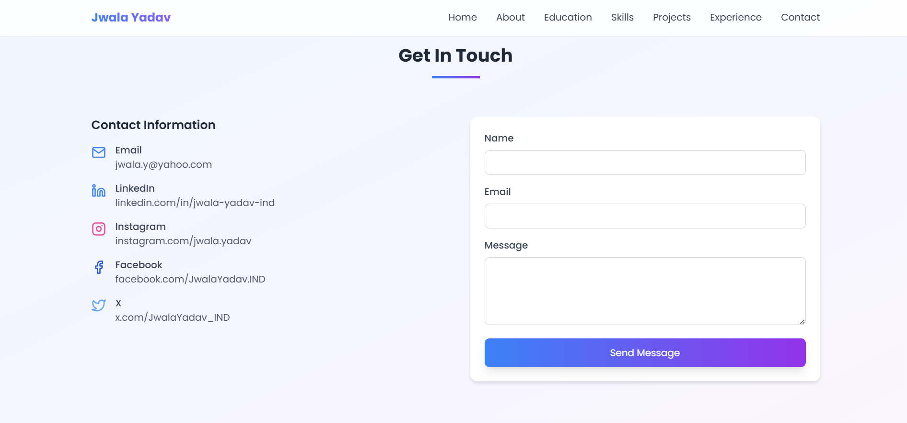

# Jwala Mahendra Yadav - Portfolio

A modern, responsive portfolio website showcasing my skills, projects, and experience as a Computer Engineer | Cloud & Salesforce Specialist | Web Developer.

## 🚀 Features

- **Responsive Design** - Works on all device sizes
- **Modern UI** - Clean and professional interface
- **Smooth Animations** - Enhanced user experience with AOS animations
- **Contact Form** - Easy way for potential employers to reach out
- **Skills Showcase** - Organized display of technical competencies

## 🛠️ Technologies Used

- HTML5
- Tailwind CSS
- JavaScript
- Feather Icons
- AOS (Animate On Scroll) Library

## 🔍 Overview

This portfolio showcases my work as a Computer Engineer and Cloud Specialist. It includes project demos, skills, and contact information to share with recruiters and collaborators.

## 🔗 Live Demo

- Live site: (https://jwalayadav-portfolio.netlify.app/)

## 📸 Screenshots

Add screenshots to the assets/images folder and reference them here:

## 🧭 Getting Started

## ⚙️ Build & Deploy

- Build (if using a bundler):
  npm run build
- Deploy to GitHub Pages, Netlify, Vercel, or your preferred host. Example (Netlify): drag the build folder to Netlify UI or connect the repo.

## 🧩 Features (expanded)

- Responsive layout with Tailwind CSS
- AOS-powered scroll animations
- Contact form with validation (replace with backend or Netlify Forms)
- Project cards with live links and source code

## 🛠 Development Notes

- Tailwind config: tailwind.config.js
- AOS: initialized in main.js
- Feather icons: used via data attributes / script

## 📫 Contact

- Email: jwala.y@yahoo.com
- LinkedIn: (https://www.linkedin.com/in/jwala-yadav-ind)
- GitHub: (https://github.com/Jwala-Yadav)
