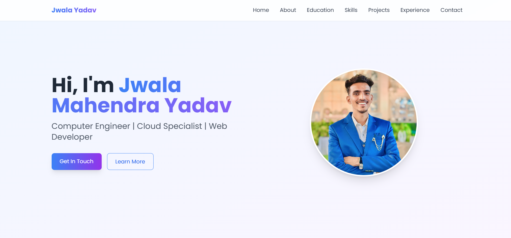

# Jwala Mahendra Yadav - Portfolio

A modern, responsive portfolio website showcasing my skills, projects, and experience as a Computer Engineer and Cloud Specialist.

## 🚀 Features

- **Responsive Design** - Works on all device sizes
- **Modern UI** - Clean and professional interface
- **Smooth Animations** - Enhanced user experience with AOS animations
- **Contact Form** - Easy way for potential employers to reach out
- **Skills Showcase** - Organized display of technical competencies

## 🛠️ Technologies Used

- HTML5
- Tailwind CSS
- JavaScript
- Feather Icons
- AOS (Animate On Scroll) Library

## 🔍 Overview

This portfolio showcases my work as a Computer Engineer and Cloud Specialist. It includes project demos, skills, and contact information to share with recruiters and collaborators.

## 🔗 Live Demo

- Live site: https://your-domain.example (replace with your deployed URL)

## 📸 Screenshots

Add screenshots to the assets/images folder and reference them here:

## 🧭 Getting Started

### Prerequisites
- Node.js >= 14 (if using a build step)
- npm or yarn
- A modern browser

### Install & Run Locally
1. Clone the repo:
   git clone https://github.com/your-username/your-repo.git
2. Install dependencies:
   npm install
3. Start a dev server:
   npm start
4. Open http://localhost:3000

(If your site is static with no build step, simply open index.html.)

## ⚙️ Build & Deploy

- Build (if using a bundler):
  npm run build
- Deploy to GitHub Pages, Netlify, Vercel, or your preferred host. Example (Netlify): drag the build folder to Netlify UI or connect the repo.

## 🗂 Project Structure

- assets/ — images, icons, fonts
- css/ or src/styles/ — Tailwind/CSS files
- js/ or src/ — JavaScript modules
- index.html — main page

(Adjust to match your actual structure.)

## 🧩 Features (expanded)

- Responsive layout with Tailwind CSS
- AOS-powered scroll animations
- Contact form with validation (replace with backend or Netlify Forms)
- Project cards with live links and source code

## 🛠 Development Notes

- Tailwind config: tailwind.config.js
- AOS: initialized in main.js
- Feather icons: used via data attributes / script

## ✅ How to Add a New Project

1. Add project image to assets/images/
2. Add a new project card in the Projects section of index.html:
   - Title, short description, technologies, live URL, repo URL
3. Test responsiveness and links

## 🤝 Contributing

1. Fork the repo
2. Create a branch: git checkout -b feature/name
3. Commit changes: git commit -m "Add ..."
4. Push and open a PR

## 📫 Contact

- Email: your.email@example.com
- LinkedIn: https://linkedin.com/in/yourprofile
- GitHub: https://github.com/your-username

## 📜 License

This project is licensed under the MIT License — see the LICENSE file for details.

## 🙏 Acknowledgements

- AOS library — https://michalsnik.github.io/aos/
- Feather Icons — https://feathericons.com/
- Tailwind CSS — https://tailwindcss.com/